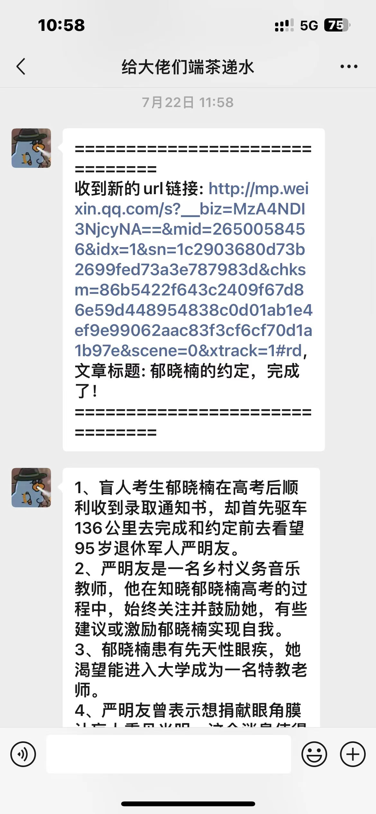

# Intro

一款集成AI对话（ChatGpt）、群聊摸鱼、定时任务、公众号文章推送、文章摘要等功能的wechat机器人。开发语言为golang，基于openwechat框架，代码修改自[wechatgpt](https://github.com/houko/wechatgpt)项目。


## Run

### 本地运行

准备工作：

1. 修改config/config.yaml配置，填入你的信息：

    ```yaml
    chatgpt:
    token: sk-xxxxx
    wechat: "true"
    openai_url: https://api.openai-proxy.com/v1/chat/completions
    openai_model: gpt-4-0613
    prompt: "You are a helpful assistant."
    wechat_keyword: 
    #telegram: your telegram token
    #tgWhitelist: username1,username2
    #tgKeyword: chatgpt

    wechat_group_onfig:
    daliy_group_name: "聊天吹水"    # 群名称
    self_name: "0x15634125"           # 本人名称（不是微信号）
    robot_name: "@给大佬们端茶递水"   # 机器人名称（不是微信号）
    ```

    - token：chatgpt api 接口 token
    - openai_url：chatgpt api url接口，使用国内的代理接口速度更快
    - daliy_group_name：选择一个日常的聊天群名，用于发送定时任务，如定时提醒等
    - self_name：自己的微信名，用于群聊过滤和监控新的公众号推文
    - robot_name：机器人微信名

2. 运行run.sh脚本。

    正常会得到一个二维码，微信扫描登陆即可，最好使用小号，需要在微信中进行实名认证，路径为`微信->我->服务->钱包->身份信息->个人信息`：

    ```
    Starting MariaDB database server: mariadbd.
    INFO[2024-09-04T02:21:24Z]/root/build/main.go:20 main.main() 程序启动
    WARN[2024-09-04T02:21:24Z]/root/build/main.go:30 main.main() true
    INFO[2024-09-04T02:21:24Z]/root/build/bootstrap/wechat.go:22 wechatbot/bootstrap.StartWebChat() Start WebChat Bot


            ██████████████    ██    ██  ████      ██    ██████████████
            ██          ██  ██    ██████████  ██    ██  ██          ██
            ██  ██████  ██  ██████████      ████        ██  ██████  ██
            ██  ██████  ██    ██████        ██    ████  ██  ██████  ██
            ██  ██████  ██  ██        ██  ██  ████      ██  ██████  ██
            ██          ██  ████  ██      ████████████  ██          ██
            ██████████████  ██  ██  ██  ██  ██  ██  ██  ██████████████
                            ████    ██  ██  ████  ████
            ████  ██    ████    ██      ██        ██    ██████  ████
            ████  ██████        ████  ██      ██      ████    ██    ██
            ██    ████████  ██████    ██      ██████████████████████
            ██  ████████              ████  ██  ██    ████  ██  ████
            ██  ████  ████          ████      ██  ████  ██    ██  ████
            ████    ██    ████████████      ██    ██████
                ██    ██          ██████          ████      ████████
                        ████      ██████  ████████  ████    ██  ██
                ████    ██    ██  ██    ████  ██    ████          ██
                ██  ██      ██            ██████        ████  ██    ██
            ██  ██████  ██      ██                  ████████      ████
                ██    ██    ████  ██    ██████████          ██    ████
            ██  ██  ██████  ████  ██████    ██  ██████████████  ██
                            ████  ████  ██  ██      ██      ██  ██████
            ██████████████  ████  ██████    ████    ██  ██  ██    ██
            ██          ██      ████████  ██    ██  ██      ██████████
            ██  ██████  ██        ██    ████████    ██████████
            ██  ██████  ██  ██  ████  ██  ██      ██    ████████████
            ██  ██████  ██    ██  ██  ████    ██    ██      ██████  ██
            ██          ██  ██  ████        ████  ████    ██      ██
            ██████████████  ██████  ████  ██  ████  ████  ██  ██  ██


    2024/09/04 02:21:37 扫码成功,请在手机上确认登录
    2024/09/04 02:21:49 登录成功
    ```

### docker 运行

项目根目录下docker build即可：

```bash
docker build -t wechatgptpro:v0.1 .
```

如果发生报错注释下面两句，建立使用能支持爬梯的网络环境：

```bash
RUN sed -i 's/deb.debian.org/mirrors.aliyun.com/g' /etc/apt/sources.list
RUN echo "nameserver 8.8.8.8" > /etc/resolv.conf
```

build完成之后执行，扫描登陆：

```
docker run -it wechatgptpro:v0.1
```

## 使用方法

### 单聊

1. 默认情况下单聊是一个AI对话机器人，调用chatgpt的api接口进行问答。

    


### 摘要机器人

1. 主动发送公众号链接可以对内容做摘要。
   
   


2. 对于已经主动关注的公众号，会监控新发送的推文并发送给自己

    


### 群聊机器人

群聊机器人的作用主要还是为了吹水摸鱼而准备，对于所有群聊的记录会存储在mysql数据库中用于统计和分析。

帮助信息：

```
# Wechat bot v0.1

1.help  输出帮助信息.
2.热搜列表  获取热搜列表.
3.xx热搜  输出对应热搜内容，默认显示前十条.
4.统计性格  统计群友们的MBTI性格特征.
5.统计主题  统计群聊的内容和方向、观
6.摸鱼次数  统计群友摸鱼次数.
7.今日股价  获取今日688023股价信息和群聊次数/摸鱼次数.
8.@我  调用ChatGpt-4的接口进行问答.
9.发送http/https链接  进行文章内容的摘要
```

1. 群聊统计性格，根据聊天记录对每个参与群聊的成员进行infp性格分析
   
    

2. 群聊统计性格，对所有当前会话的对话内容做摘要分析
   
   

3. 群聊定时任务，用于定时推送热搜或者股价等信息
   
   

4. 群聊AI对话，主动@机器人就变成了对话机器人
   
   

5. 群聊嘴臭检测，并会怼发言者
   
   

6. 摸鱼次数，对当天群成员群聊次数做统计
   
    


## 后续开发计划

1. 对图片或者视频的分析摘要
2. 对机器人的摘要链接主动分类并做知识库
3. ...